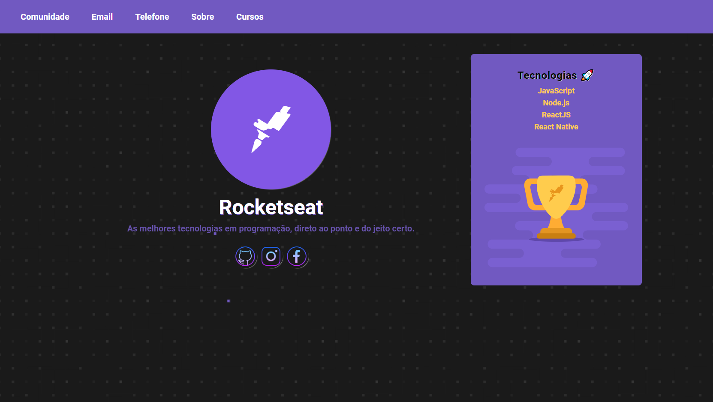
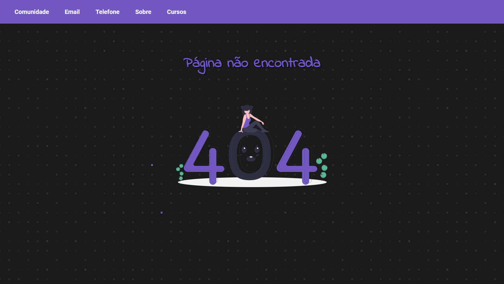
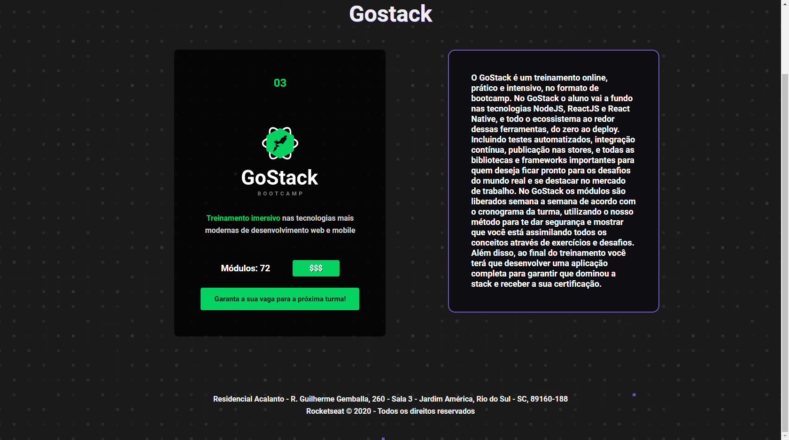

<h1 align = "center"> 
    
</h1>

## 📌 Índice dos desafios 🏆

Introdução à programação WEB 💻 

- [x] [1-1: Primeiros passos com JS](#center-desafio-1-1-primeiros-passos-com-js-center)
- [x] [1-2: Lidando com objetos e vetores](#center-desafio-1-2-lidando-com-objetos-e-vetores-center)
- [x] [1-3: Funções e estruturas de repetição](#center-desafio-1-3-funções-e-estruturas-de-repetição-center) 
- [x] [1-4: Aplicação: Operações bancárias](#center-desafio-1-4-aplicação-operações-bancárias-center)

Iniciando no Front-end 🎀 

- [x] [2-1: Primeiro HTML](#center-desafio-2-1-primeiro-html-center)
- [x] [2-2: Página de descrição](#center-desafio-2-2-página-de-descrição-center)
- [x] [2-3: Página de cursos e iframe](#center-desafio-2-3-página-de-cursos-e-iframe-center)
  

Iniciando no Back-end 📅 

- [x] [3-1: Primeiro servidor](#center-desafio-3-1-primeiro-servidor-center)
- [x] [3-2: Arquivos nunjucks e dados dinâmicos](#center-desafio-3-2-arquivos-nunjucks-e-dados-dinâmicos-center)
- [x] [3-3: Página de descrição do curso](#center-desafio-3-3-página-de-descrição-do-curso-center)

## 🚀 Tecnologias utilizadas 

Os desafios foram feitos usando as seguintes tecnologias

- **[JavaScript](https://developer.mozilla.org/pt-BR/docs/Web/JavaScript)**
- **[Node.js](https://nodejs.org/en/)**
- **[Nunjucks](https://mozilla.github.io/nunjucks/)**

## 💻 Introdução à programação WEB 

## **Desafio 1-1:** Primeiros passos com JS 

### 👨‍💻 **Atividades**

- **Cálculo de IMC;**
- **Cálculo de aposentadoria.**

### 📚 **Conceitos estudados**
- [x] Variáveis;
- [x] Condicionais;
- [x] Operadores.

## **Desafio 1-2:** Lidando com objetos e vetores 

### 👨‍💻 **Atividades**

- **Construção e impressão de objetos;**
- **Vetores e objetos.**

### 📚 **Conceitos estudados**
- [x] Objetos; 
- [x] Vetores.

## **Desafio 1-3:** Funções e estruturas de repetição 

### 👨‍💻 **Atividades**

- **Usuários e tecnologias;**
- **Busca por tecnologia;**
- **Soma de despesas e receitas.**

### 📚 **Conceitos estudados**
- [x] Funções e métodos;
- [x] Estruturas de repetição;
- [x] Escopos.

## **Desafio 1-4:** Aplicação: Operações bancárias 

### 👨‍💻 **Atividades**

- **Operações bancárias;**

### 📚 **Conceitos estudados**
- [x] Booleanos;
- [x] Organização;
- [x] Padronização;
- [x] Escrita. 

--- 

## 🎀 Iniciando no Front-end 

## **Desafio 2-1:** Primeiro HTML 

### 🎨 **Atividades**

> Criar um arquivo html que contenha um favicon e um header com 3 links: Comunidade, Email e Telefone.

### 📚 **Conceitos estudados**

- [x] Links;
- [x] Background;
- [x] Fontes;
- [x] Espaçamentos. 

## **Desafio 2-2:** Página de descrição 

### 🎨 **Atividades**

> A partir do arquivo do desafio 2-1, adicionar um novo link no header chamado Sobre. Essa página deverá mostrar informações referentes a Rocketseat.

### 📚 **Conceitos estudados**

- [x] Imagens;
- [x] Textos;
- [x] Listas;
- [x] Bordas;
- [x] CSS em links.   

### 🔨 Resultados

---

## **Desafio 2-3:** Página de cursos e iframe 

### 🎨 **Atividades**

> A partir do arquivo do desafio 2.2, adicionar no header um link chamado Conteúdos. Essa página deve conter um grid onde devem ser mostrados os 3 principais cursos da Rocketseat: Starter, Launchbase e GoStack. Ao clicar em um dos cursos, deve ser aberta uma modal onde um iframe irá carregar as informações do curso selecionado.

### 📚 **Conceitos estudados**

- [x] Grid;
- [x] Alinhamento;
- [x] DOM;
- [x] Modal;

### 🔨 Resultados

---

## 📅 Iniciando no Back-end 

## **Desafio 3-1:** Primeiro servidor 

### 👨‍🍳 **Atividades**

> Nesse desafio você deve criar um servidor que tenha duas rotas que devem retornar o conteúdo dos html gerados no desafio 2-3 (páginas de **Cursos** e **Sobre**). Além disso, deve ser implementando um arquivo padrão (layout.njk) que reaproveite o código em comum entre esses dois e também um arquivo que sirva uma página de erro 404.

- Erro 404 é comum aparecer em páginas da internet, quando não foi encontrado nenhum conteúdo.

### 📚 **Conceitos estudados**

- [x] Servidor;
- [x] Rotas;
- [x] Template Engine;
- [x] Requisições.

### 🔨 Resultados

---

## **Desafio 3-2:** Arquivos nunjucks e dados dinâmicos 

### 👨‍🍳 **Atividades**

> Nesse desafio você deve atualizar os arquivos com informações de cursos e descrição de forma dinâmica.

### 📚 **Conceitos estudados**

- [x] Dados dinâmicos;
- [x] Estruturas condicionais;
- [x] Template Engine.

---

## **Desafio 3-3:** Página de descrição do curso 

### 👨‍🍳 **Atividades**

> Nesse desafio você deve criar uma página de descrição do curso que deve ser chamada no lugar da modal quando o usuário clicar no card do curso.

### 📚 **Conceitos estudados**

- [x] Rotas;
- [x] Route params;
- [x] Iteração de Array;
- [x] Template Engine.

### 🔨 Resultados

# 📜 Licença

Realizado em 2020. Esse projeto está sob a [licença MIT](/LICENSE).

## Feito com 💚 por Leonardo Campello 